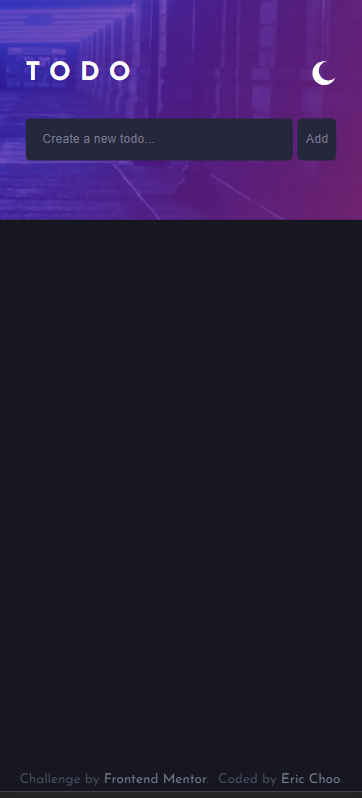
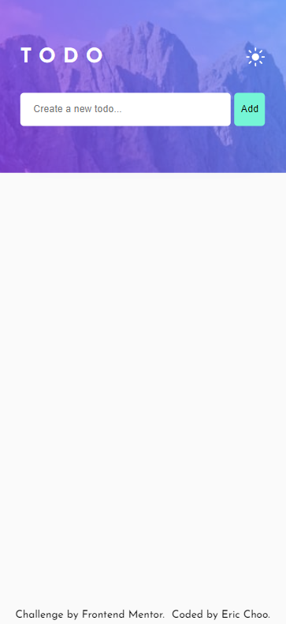
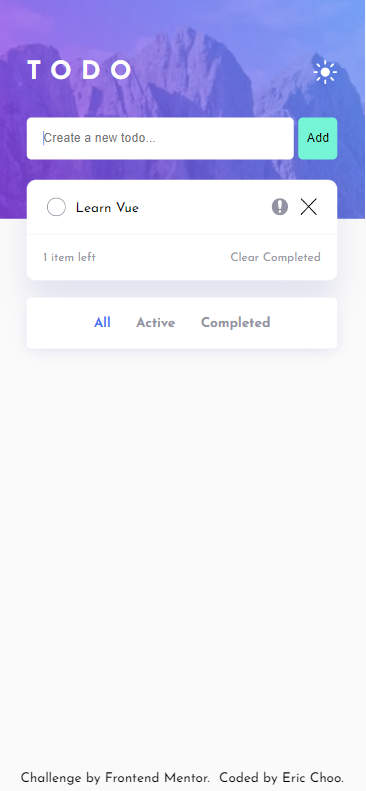
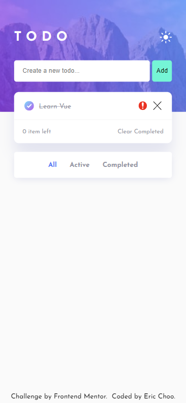

# Frontend Mentor - Todo app solution

This is a solution to the [Todo app challenge on Frontend Mentor](https://www.frontendmentor.io/challenges/todo-app-Su1_KokOW). Frontend Mentor challenges help you improve your coding skills by building realistic projects. 

## Table of contents

- [Overview](#overview)
  - [The challenge](#the-challenge)
  - [Screenshot](#screenshot)
  - [Links](#links)
- [My process](#my-process)
  - [Built with](#built-with)
  - [What I learned](#what-i-learned)
  - [Useful resources](#useful-resources)
- [Author](#author)

## Overview

### The challenge

Users should be able to:

- View the optimal layout for the app depending on their device's screen size
- See hover states for all interactive elements on the page
- Add new todos to the list
- Mark todos as complete
- Delete todos from the list
- Filter by all/active/complete todos
- Clear all completed todos
- Toggle light and dark mode

Extra 🎯💡🧐
- Data are store in browser localStorage
- Light and dark mode will save in localStorage when toggle
- Mark todos as urgent task
- Show alert message when adding empty todo and clearing all completed todo
- Click on the task description to show the full description and edit todo

### Screenshot

Mobile view <br>

<p>




</p>

Desktop view


https://user-images.githubusercontent.com/90197574/195644416-b0683f05-3ec5-493f-87ae-e1996f469a06.mp4


### Links:

- Solution URL: [Github](https://github.com/ericcst197/vue-todo-app)
- Live site URL: [Live demo](https://ericcst197-vue-todo-app.netlify.app/)
- Short video demo: [Youtube](https://youtu.be/mWdNuPJDXwI)

## My process

### Built with:

- [Vue3](https://vuejs.org/) - JS framework
- SASS / SCSS
- Local Storage
- Desktop-first workflow

### What I learned:

1. The basics of Vue.js:
  - Two-way data binding
  - Template syntax and expressions
  - Vue directives, loops and conditional rendering
  - Handling user Inputs
  - Handling Events
  - Vue.js Methods and Computed Properties
  - Attribute Bindings and dynamic classes


2. CSS - Remove autocomplete style:
```css 
  &:-webkit-autofill,
  &:-webkit-autofill:hover,
  &:-webkit-autofill:focus,
  &:-webkit-autofill:active {
      -webkit-box-shadow: 0 0 0 1000px #fff inset !important;
  }
```

3. JS - Change the layout using event listener:
```js
  window.addEventListener("resize", this.myEventHandler);

  myEventHandler(e) {
    let width =  e.target.innerWidth
    this.windowWidth = width
  }

  displayDesktop(media = this.windowWidth){...}
  displayMobile(media = this.windowWidth){...}
```

### Useful resources

- [Vue School.io](https://vueschool.io/articles/vuejs-tutorials/how-to-structure-a-large-scale-vue-js-application/) - This is an official website for Vue.js, it helps me to understand how we can structure the files when building more component in a particular project.

## Author

- Github - [Eric Choo](https://github.com/ericcst197)
- Frontend Mentor - [@ericcst197](https://www.frontendmentor.io/profile/yourusername)

# TodoAPP
# TodoAPP
